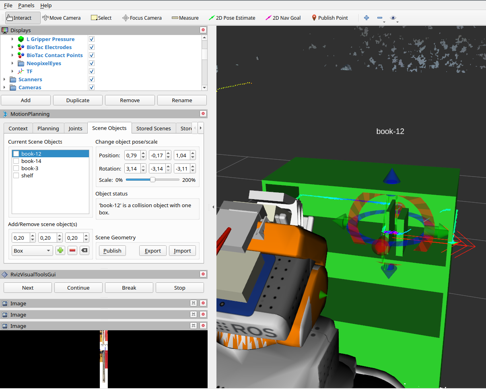

# PBBM-librarian-robot 

The librarian project aims to implement a librarian system that can rearrange books in the shelf.

We split the whole project into three modules:

* librarian\_vision : vision pipeline
* librarian\_manipulation: manipulation pipeline
* librarian\_common: common resources like topic definition or books database

A corresponding conference publication is currently under review.


## Setup & Running
start the venv for the requirment.txt 
```bash
virtualenv venv
source venv/bin/activate
pip install -r requirement.txt
```

Next you can start the vision and grasping pipelines. View their respective documentations on startup, but as a quick guide one can start the vision pipeline through
`roslaunch librarian_vision_node librarian_vision_pr2_azure.launch`
and the grasping pipeline through
`roslaunch librarian_grasping_initial grasping.launch`

After you have started the vision and grasping pipeline, you need to start the interaction node with
`rosrun librarian\_resources interaction_node.py`

Finally, you can send a command to engage all pipelines. This command needs to be send on the rostopic *chatter*, e.g. through 
`rostopic pub /chatter std_mgs/String "data: \'r\'"`
with *r*, *y*, *w*, and *sort* as possible data values. *sort* attempts to sort all books while the other commands only interact with the red, yellow or white book respectively.


## Additional Information
If the shelf pointcloud does not align properly with the shelf collision model, you can adjust the offset values at the bottom of `librarian_shelf_from_image.py`.

In 'interaction_node.py', each book type, *y*, *r*, and *w*, can be assigned the option to either pick and place the book or just picke the book. Currently, *y* and *w* are set to just pick while *r* is set to pick and place.

If some error occurs during the execution, for example a wrong book detection or a path planning issue during the manipulation part, and the system need to be reset, remember to manually remove an attached book from the robot in the moveit planning scene, if applicable, and publish the change to the planning scene. Otherwise, the grasping and vision pipeline might produce errors regarding wrong timestemps or duplicate books. To remove a book from the planning scene, the vision pipeline needs to be turned off for a while, because it otherwise constantly updates the planning scene and overwrites the manual changes immediately.



*Figure 1: On the motion planning scene, unclick the book-Nr. and click the publish button.*

