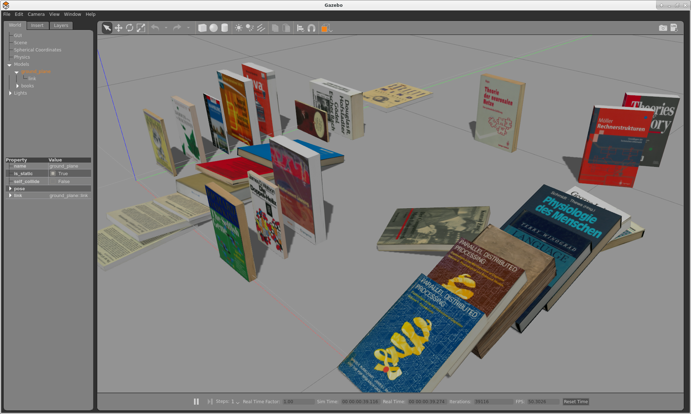
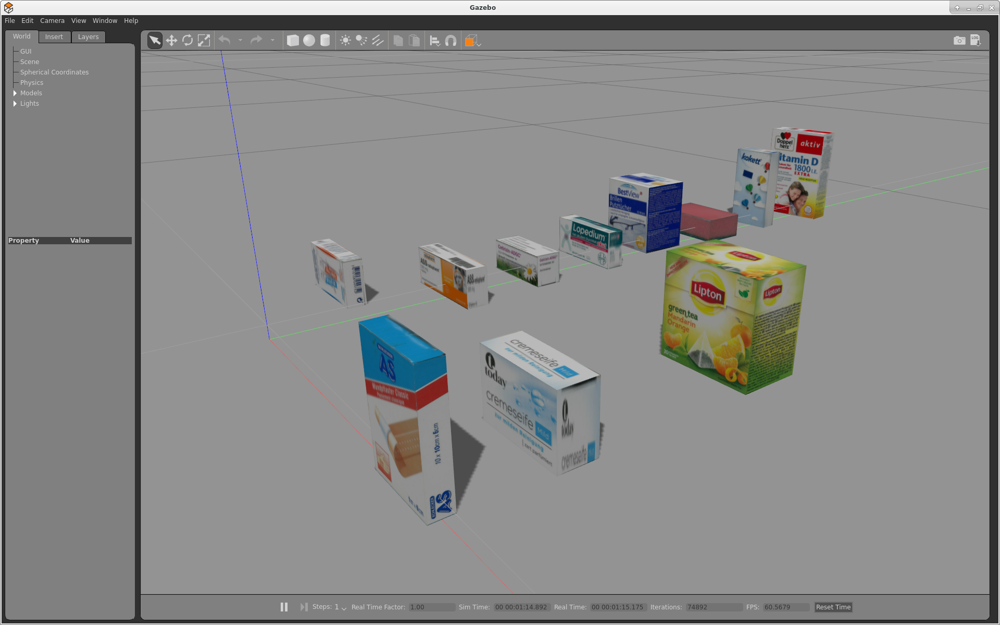
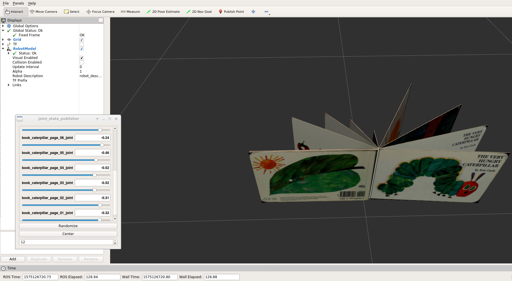
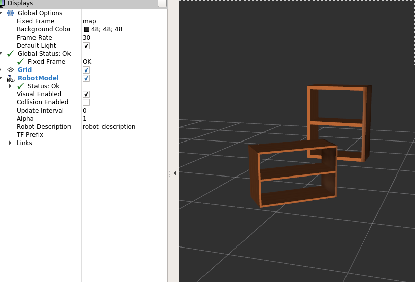
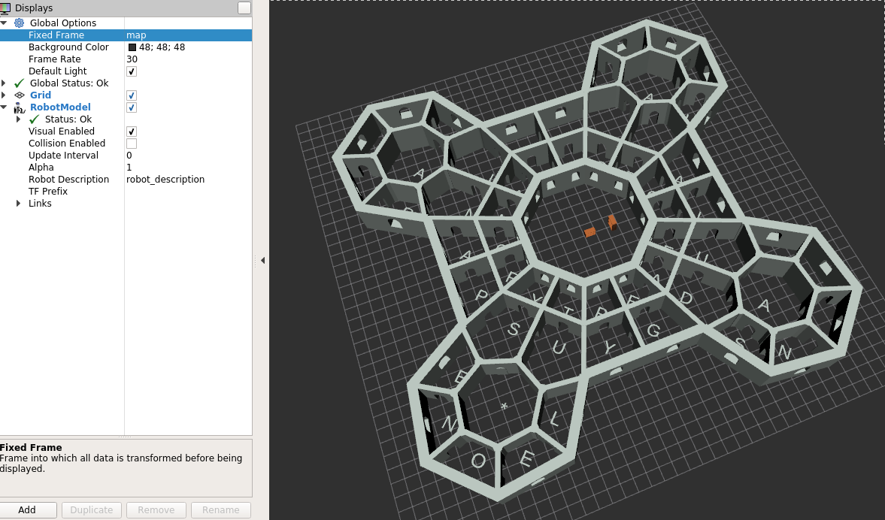

# tams_books_world

A ROS catkin package with 3D-models of books and similar
objects for our <b>bookshelf</b> manipulation scenario.
Also includes some Gazebo worlds and demos.

We provide a couple of books of different sizes and weights,
with textures from well-known computer science textbooks
and some classics.
Each book comes as a 3D Collada mesh and associated URDF
model for use in Moveit!, physics simulation in Gazebo,
and visualization in rviz.

Some book models include joints, so that pages can be turned.

## Download and Installation

Just clone this repository into your catkin workspace;
then run ``catkin make``(or ``catkin_build``).
There are no ROS nodes to build in this package.

## Demos

Try running 
```
roslaunch tams_books_world demo.launch
```

A detailed description of available Gazebo worlds and demos will
be provided soon.


## List of Books

The following list (possibly incomplete) lists the book
modeled as basic cubes or meshes.
You can probably find many of these books in second-hand bookstores.



### Classics

* Richard Dawkins, The Selfish Gene.
  Oxford Paperbacks, 1989.<br/>
  size 13.0 x 19.6 x 2.0 cm, 246 grams.

* George Dyson, Darwin among the Machines.
  Penguin, 1997.<br/>
  size 13.0 x 19.8 x 1.8 cm, 228 grams.

* D.E.Knuth, Art of Computer Programming, Volume 1.
  Addison Wesley, hardcover, 1973.<br/>
  size 16.7 x 24.0 x 3.7 cm, 1080 grams.

* D.E.Knuth, Art of Computer Programming, Volume 4, Fascile 0,
  Introduction to Combinatorial Algorithms and Boolean Functions.
  Addison Wesley, 2008, paperback<br/>
  size 24.0 x 16.1 x 1.4 cm, 400 grams

* D.E.Knuth, Art of Computer Programming, Volume 4, Fascile 1,
  Bitwise Tricks and Techniques, Binary Decision Diagrams.
  Addison Wesley, 2009, paperback<br/>
  size 24.0 x 16.1 x 1.7 cm, 498 grams

* D.E.Knuth, Art of Computer Programming, Volume 4, Fascile 2,
  Generating All Tuples and Permutations.
  Addison Wesley, 2005, paperback.<br/>
  size 24.0 x 16.1 x 0.93 cm, 274 grams

* Marvin Minsky, The Society of Mind.
  Simon & Schuster, 1985.<br/>
  size 21.5 x 28.0 x 1.9 cm, 764 grams

* Douglas R. Hofstadter, Gödel, Escher, Bach. 
  German hardcover edition, Klett-Cotta, 1979.<br/>
  size 16.2 x 23.4 x 5.5 cm, 1100 grams

* Robert Louis Stevenson, Dr. Jekyll and Mr. Hyde,
  Penguin paperback, 1964.<br/>
  size 11.0 x 18.0 x 0.7 cm, 56 grams.

* James D. Watson, Die Doppel-Helix,
  German paperback, rororo, 1984.<br/>
  size 11.5 x 19.0 x 1.0 cm, 114 grams.


### Machine Learning

* Simon Haykin, 
  Neural Networks and Learning Machines, 3rd. Edition, paperback,
  Pearson International, <br/>
  size 17.7 x 23.0 x 3.2 cm, 1316 grams

* Leon Bottou, Olivier Chapelle, Dennis DeCoste, Jason Weston, Eds.,
  Large-Scale Kernel Machines, MIT Press, 2007<br/>
  size 21.7 x 25.0  x 2.4 cm, 978 grams

* Marco Wiering, Martijn van Otterlo (Eds.). 
  Reinforcement Learning - State-of-the-Art.
  Springer, 2012.<br/>
  size 15.5 x 23.5 x 3.5 cm, 964 grams.

 
### Fun 

* Voynich Manuscript, parchment, 102 pages.<<br/>
  Beinecke Rare Book and Manuscript Library Yale University,<br/>
  https://brbl-dl.library.yale.edu/vufind/Record/3519597<br/>
  size 16.0 x 23.0 x 5.0 cm, weight not known.

* Diverse Authors, The Best of Bad Hemingway,<br/>
  size 12.6 x 18.4 x 1.0 cm, 210 grams.

* Eric Carle, The Very Hungry Caterpillar, 26 pages.<br />
  Articulated model, all pages can be turned.
  size 31.0 x 21.6 x 0.13 cm, weight 512 grams.

* University of Hamburg, 20neunzehn.<br/>
  size 20.5 x 28.2 x 0.7 cm, 308 grams.

* Hamburg Guide (IROS 2015 edition),
  BKB Verlag, 2015.<br/>
  size 10.8 x 18.5 x 0.5 cm, 62 grams.


### Books by Hamburg professors and lecturers

* Klaus Lagemann, Rechnerstrukturen, Verhaltensbeschreibung und Entwurfsebenen,
  Springer, 1987.<br/>
  size 24.2 x 16.5 x 1.5 cm, 554 grams.

* D.P.F. Möller, Rechnerstrukturen,
  Springer, 2003.<br/>
  size 23.6 x 15.3 + 2.3 cm, 592 grams.

* Konrad Zuse, Der Computer - Mein Lebenswerk, 2nd. Ed., hardcover.
  Springer, 1984.<br/>
  size 17.2 x 24.7 x 2.1 cm, 764 grams.

* fnh, Java für Fortgeschrittene.
  Springer, 1997.<br/>
  size 15.7 x 23.5 x 3.4 cm, 906 grams.

### Masterproject 2022

* "ifip": K Duncan, K Krueger Eds., Linkage and Developing Countries, Information Processing '94
  North-Holland 1994
  size 15.0 x 22.5 x 2.2 cm, 823 grams

* "bits": Erstsemester Bits 2016, Fachschaft Informatik, WS 2016
  size 14.8 x 20.7 x 1.0 cm, 200 grams

* "twki": Werner Kolbe, Technik-Wörterbuch Künstliche Intelligenz
  Verlag Technik Berlin 1990
  size 12.5 x 19.5 x 1.7 cm, 283 grams

* "khoros": Khoros 2.1 Foundation Services
  Khoral Research Inc, 1993
  size 17.3 x 21.3 x 2.5 cm, 700 grams

* "ttl2": Texas Instruments, The TTL Data Book Volume 2
  size 14.8 x 21.0 x 4.6 cm, 1370 grams

* "logic": E. Hörbst Ed., Logic Design and Simulation
  North Holland 1986
  size 17.3 x 24.5 x 2.0 cm, 623 grams
  size 


## Medicine boxes

Apart from the books, we also include a few models of medicine
boxes.



## Articulated books

Some books include revolute joints, so that pages can be turned
in simulation and visualization. For details of the modelling
approach, please refer to the xacro source code.




## Furniture

At the moment, we only have a pretty generic bookshelf and some
bookends.




## Bookends

http://www.thingiverse.com/thing:1837114
Coffe Cup Bookends by FDM_Guru is licensed under the Creative Commons - Attribution - Non-Commercial - No Derivatives license.
http://creativecommons.org/licenses/by-nc-nd/3.0/

https://www.thingiverse.com/thing:2769159
Lightweight Bookend by xyzaxis is licensed under the Creative Commons - Attribution - Non-Commercial license.
http://creativecommons.org/licenses/by-nc/3.0/


## Libraries

Of course, books need a library, and there can only be one.
At least, this one allows you to show off your localization and
pathplanning software. 
And no, the door to the Finis Africae won't open...




  
## Gazebo won't stop

Killing a roslaunch'ed Gazebo cleanly has been broken for years
(I guess the developers never cntl-c their beloved software).
Changing the sigkill timeout seems to be the only "documented" way 
to stop the thing. 

For kinetic this can be found in:
``` 
    /opt/ros/kinetic/lib/python2.7/dist-packages/roslaunch

``` 
In the file nodeprocess.py there will be 2 variables on line 57 and 58.
``` 
    _TIMEOUT_SIGINT = 15.0 #seconds  make this 3
    _TIMEOUT_SIGTERM = 2.0 #seconds  make this 1
```

## Extracting pages from PDF

```
pdftoppm -jpg book.pdf -r 150 prefix
```
  

   


